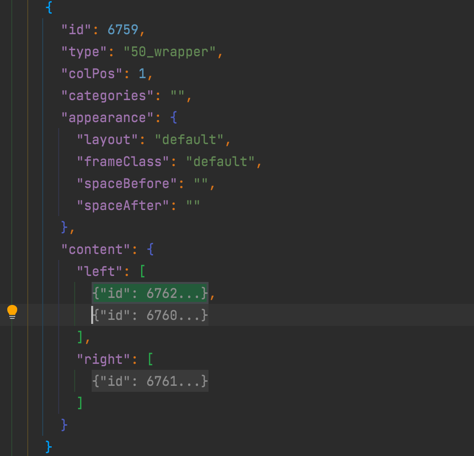
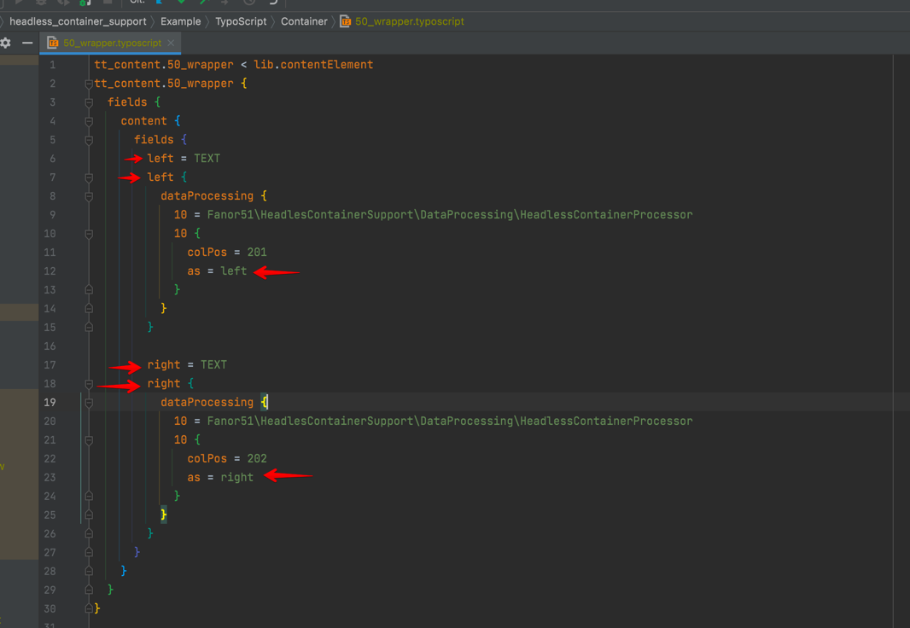

# Headless Container Support (For TYPO3 v11/v12/v13)

## Install 

Install as any other extension:

- *Composer*: `composer require fanor51/headless-container-support`

TYPO3 Version | v11 | v12 | v13
--- |-----| --- | --- 
This Version | 2.* | 3.* | ^3.2

## Use 
Take a look into ``Example/TypoScript/Container/50_wrapper.typoscript`` there is an example on how to configure the container. 
The special thing here is that we add a "new" data processor to the config. the processor is mainly the one from the container extension. Something was added only at the end

After this you need to overwrite the standard ``lib.content`` object with a where clause to exclude the "special" colPos´s from the container extension.
```
# PRELOAD EXTENSIONS SETTINGS
@import 'EXT:headless/Configuration/TypoScript/'

# Overwrite the default lib.content from the headless extension with added colPos where in YOUR Config Extension
# Add the colPos IDS from your Container Configuration to the where
lib.content = CONTENT_JSON
lib.content {
  table = tt_content
  select {
    orderBy = sorting
    where = colPos NOT IN (201,202,203)
  }
}
```

In this example we use the colPoses 201,202 and 203 for container contents which where setted in the container config under ``Configuration/TCA/Overrides/tt_content.php``.
An example for this you can find here: ``Example/TCA/Overrides/tt_content.php``

In the end it should look like this:



A complete json example is under: ``Docs/Json/Example.json``

## Customize

You can customize the names from the equivalent of the colPos in the TYPOSCRIPT like you need or want it.



## Credits
The development of the extension was supported by the TYPO3 agency [brandung GmbH](https://www.agentur-brandung.de/).